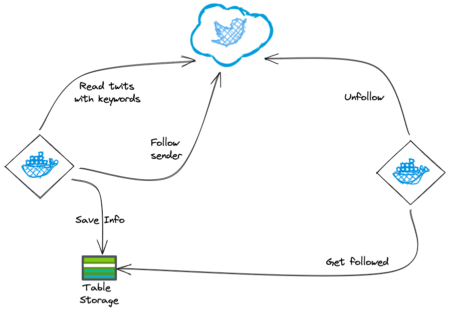

[](https://github.com/sebagomez/zombiefollower/actions/workflows/docker-build.yml)

## 🧟 Zombie follower

I used this bot to follow accounts that twitted about a particular subject.

To make it work for you, you'll need to create a twiiter app. Go to https://developer.twitter.com/en/portal/projects-and-apps and create an APP. Grab the API Key and Secret. Make sure you go to User Authentication Settings and under App Permissions select *Read and Write*.   


You'll also need an Azure Storage table to store followed accounts (in case you want to unfollow them at a later time).

Now execute the binary as follows:
```bash
dotnet zombiefollower.dll follow --search <search-terms> --twitter-api-key <twitter-api-key> --twitter-api-secret <twitter-api-secret> --azure-account <azure-account> --azure-key <azure-key> 
```

You will then be asked to validate your twitter account in your browser and paste the provided code back to the command line.

And voila! You'll be following (A LOT) of people that twitted about Kubernetes.

Keep in mind the credentials are serialized locally, so you don't have to send credentials everytime you want to run the zombie. Use the config-path argument to tell the progeam the directory where the credential files should be read from and serialized to.

```
❯ dotnet zombiefollower.dll --help
Description:
  Follows twitter users that had twiited a specific term

Usage:
  zombiefollower [command] [options]

Options:
  -dr, --dry-run                                  Shows the list of accounts that would be followed/unfollowed (no modifications done) [default: False]
  -cf, --config-path <config-path>                Path where credentials will be read from and/or written to [default: ./]
  -tk, --twitter-api-key <twitter-api-key>        Twitter API Key (or TWITTER_API_KEY env var)
  -ts, --twitter-api-secret <twitter-api-secret>  Twitter API Secret (or TWITTER_API_SECRET env var)
  -aa, --azure-account <azure-account>            Azure Storage account name (or STORAGE_ACCOUNT env var)
  -ak, --azure-key <azure-key>                    Azure Storage key (or STORAGE_KEY env var)
  --version                                       Show version information
  -?, -h, --help                                  Show help and usage information

Commands:
  follow    Follows users that twitted about the <search> argument
  unfollow  Unfollows users followed via zombiefollower before the <from> date argument
```



Use this bot at your own risks. There are sone twitter rules that prevent exacly this https://help.twitter.com/en/using-twitter/twitter-follow-limit

### Docker

There's a docker image you can run at [Docker Hub](https://hub.docker.com/repository/docker/sebagomez/zombiefollower).

> docker run -it --rm -v /Users/seba:/tmp/cred sebagomez/zombiefollower unfollow --twitter-api-key <twitter-api-key> --twitter-api-secret <twitter-api-secret> --azure-account <azure-account> --azure-key <azure-key> --config-path /tmp/cred 

There you will be promted with your Twitter authorization key

```bash
Getting Twitter authentication token...done!
Please open your favorite browser and go to this URL to authenticate with Twitter:
https://api.twitter.com/oauth/authorize?oauth_token=<SOME_TOKEN>
Insert the pin here:
```

Open your broser and paste the url provided, after authorizing at twitter.com, copy the provided pin and paste it in the console... and voila!

In my case I want the program to use the credentials I already have serialized under ` /Users/seba`
